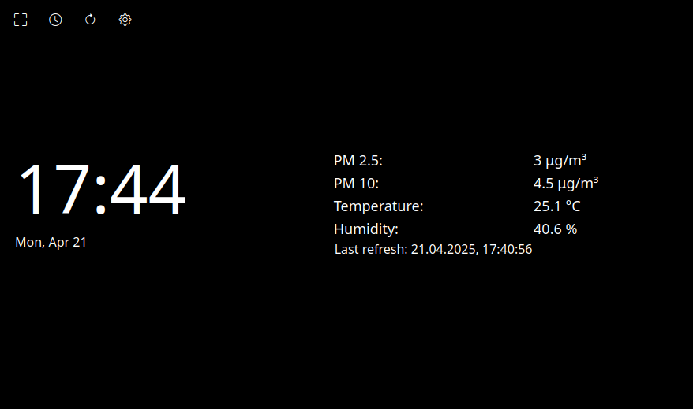
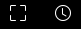
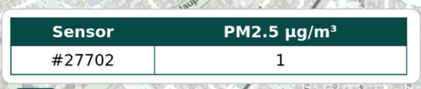
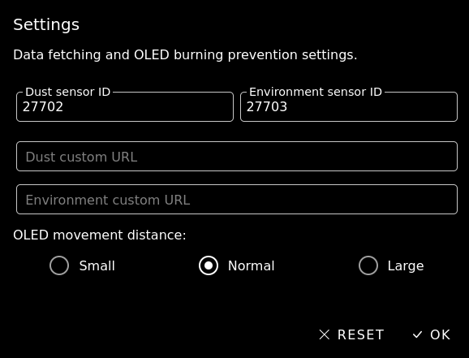
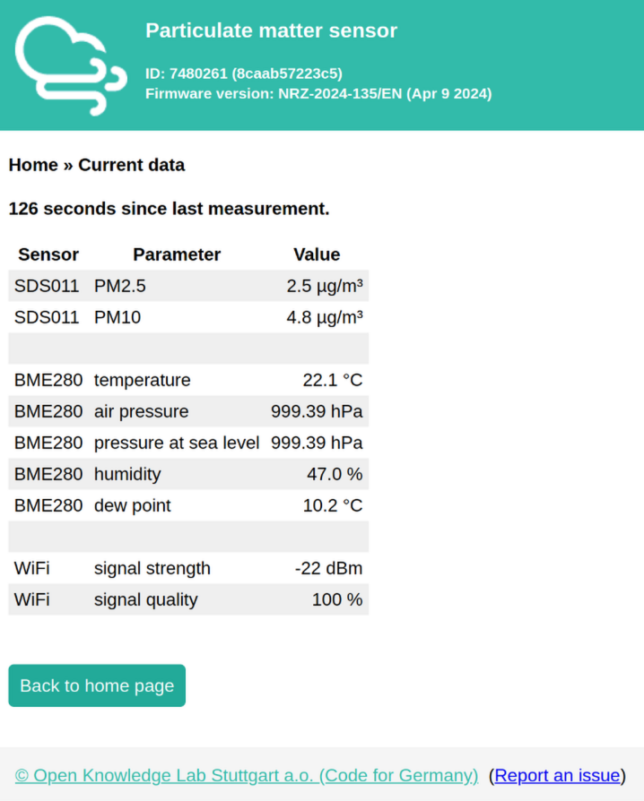

# SC Weather Station

**SC Weather Station** is dust, weather and clock always-on display app. \
It pulls pollution and weather data from [sensor.community](http://sensor.community/) sensors and displays it OLED friendly, modern way.

### [LIVE DEMO](https://hyperstown.github.io/station)

## Preview



## Basic features:

- Fullscreen
- Wake lock

Represented by those icons:



## Configuration

Currently it is necessary to set either ID of both dust sensor (SDS011) **and** environment sensor (BME280) or URLs to dust and environment API.

The ID of a sensor can be obtained from https://maps.sensor.community \
Select sensor you want to monitor and copy it's ID **WITHOUT HASH**



This gives us ID of dust sensor.\
By default PM2.5 is shown on the map:


To get ID of environment sensor, switch this menu to temperature, humidity or pressure.


Again select sensor you want to monitor and copy it's ID **WITHOUT HASH**


Next, open settings and pasted copied values like this:



**NOTE:** If you don't have environment sensor in one location just pick closest one. 

**NOTE 2:** Usually environment sensor will have ID dust sensor id + 1


Click OK and you're good to go!

RESET button will revert to last accepted configuration.

## Optional configuration:

OLED movement distance is a setting that allows to control how much elements should move around the screen. By default it is set to reasonable distance but some displays may require to change it to small or large.\
Each element is moved by 1px every 60 seconds. 


## Self hosted - localhost API

This repo also provides a way to scrape sensor data from sensors on your local network.

Find your sensor IP and go to current data:



Copy URL and start the server like this:

```bash
SOURCE_DATA_URL="<url>" python -m server.run <port> (optional, default 8000)
```

Example:
```bash
SOURCE_DATA_URL="http://192.168.1.15/values" python -m server.run 3000
```

in settings specify custom URLs for sensors like this:

Dust URL: `http://localhost:3000/api/sensors/values?sensor=SDS011`

Environment URL: `http://localhost:3000/api/sensors/values?sensor=BME280&parameter!=pressure at sea level`


**NOTE:** If custom URLs are present sensor IDs are ignored.

\
**NOTE 2:** You can also give path to app DIR so server will also serve app, not only api. *Please keep in mind that wake lock won't work unless you serve app via https or localhost.*

Example:
```bash
SOURCE_DATA_URL="http://192.168.1.15/values" python -m server.run 3000 ./src
```
